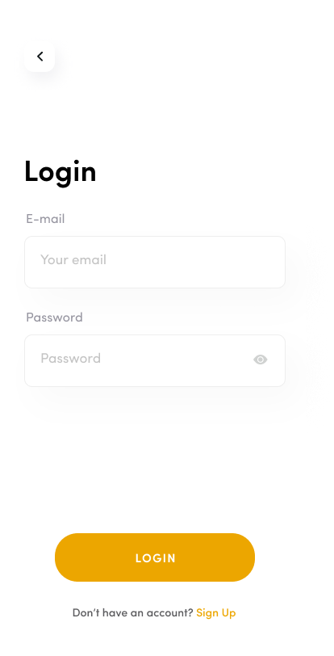
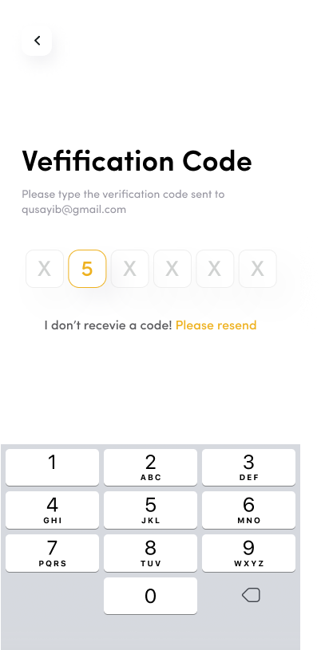
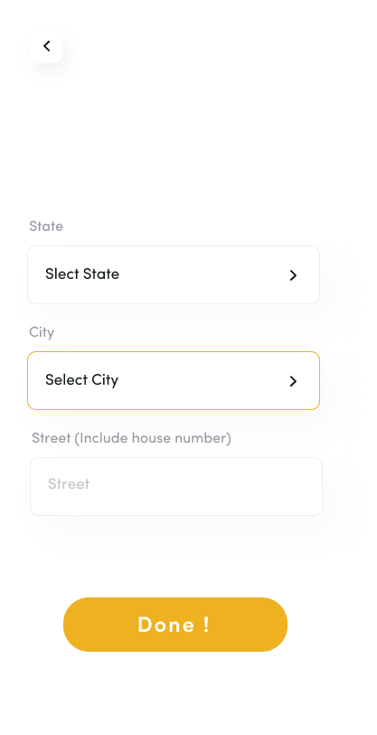
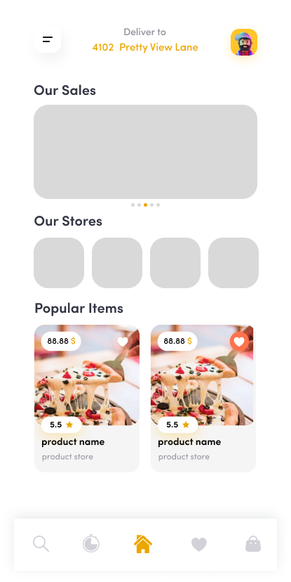
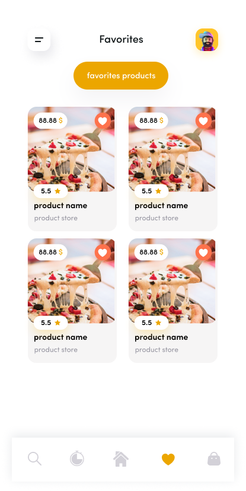
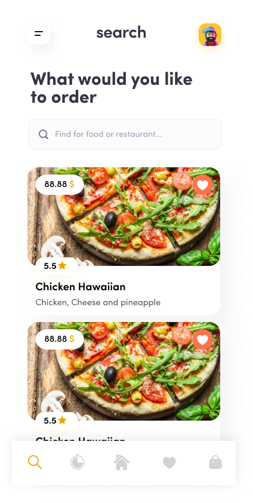
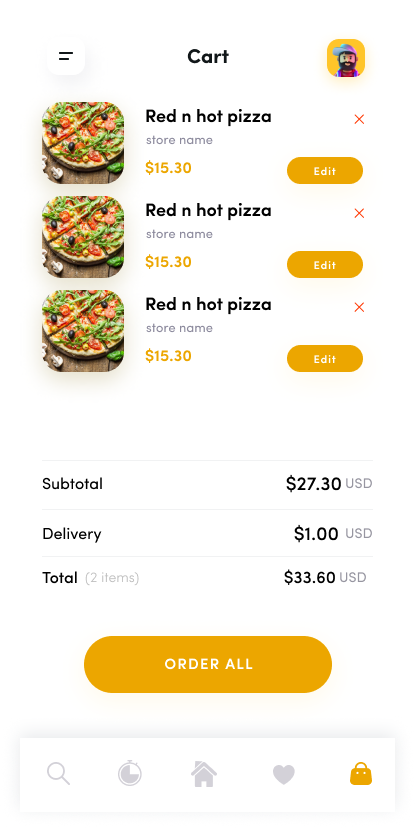
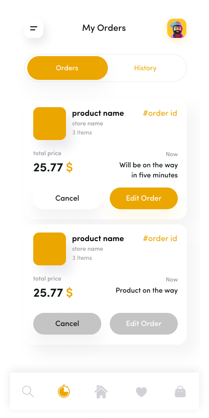

## Delivery App 🚀

This project is a **simple delivery mobile app** built with Flutter by a **fresh front-end Flutter development group**. ✨  
It is one of our first real projects as we enter the programming world and try to **learn, practice, and expand our experience**. 💻📱

### 🚚 What this app does

- **User experience**: modern UI with a splash screen and login flow. 🎨
- **Home & navigation**: bottom navigation bar with multiple main sections. 🧭
- **Search**: browse and search for products or stores. 🔍
- **Cart & orders**: add items to cart and review current and previous orders. 🛒📦
- **Favorites**: save favorite products to access them quickly. ⭐
- **Profile & sidebar**: basic profile information and navigation drawer. 👤

### 🧰 Tech stack

- **Framework**: Flutter 🐦
- **Language**: Dart 💙
- **Platforms**: Android (and ready for iOS/Web with Flutter support) 📲

### 🪄 Design

- Screenshots:
  <p float="left">
  
  
  
  
  
  
  
  
  
  
  
  
  
  
  
  
  

</p>

- 🎥 App Demo:

coming soon!

### ▶️ How to run the project

1. Make sure you have Flutter installed and configured. 🛠️
2. Clone or download this project. 📁
3. Open the project in your IDE (VS Code, Android Studio, etc.). 🧑‍💻
4. Run:
   ```bash
   flutter pub get
   flutter run
   ```

### 🌱 About the team

We are a **new front-end Flutter mobile development group**. 🙋‍♀️🙋‍♂️  
This app is a **learning project**, where we practiced:

- Building screens and navigation 🧩
- Working with basic models and services 🗂️
- Organizing a Flutter project structure 📂

We know there is still a lot to improve, but this project represents our **first steps into real-world app development** and our desire to grow as Flutter developers. 🚶‍♂️🚶‍♀️🌟
